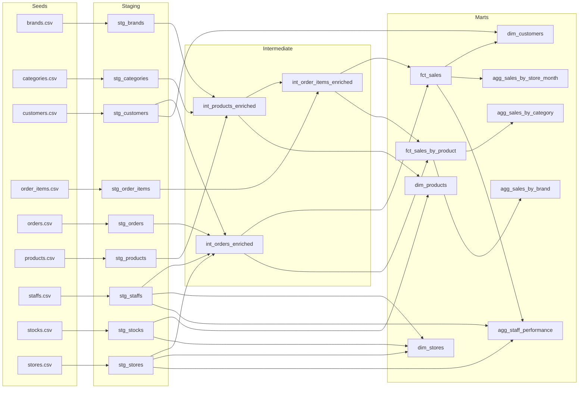

# Data Lineage - Local Bike

```mermaid
graph LR
    subgraph Seeds
        brands[brands.csv]
        categories[categories.csv]
        customers[customers.csv]
        order_items[order_items.csv]
        orders[orders.csv]
        products[products.csv]
        staffs[staffs.csv]
        stocks[stocks.csv]
        stores[stores.csv]
    end

    subgraph Staging
        stg_brands[stg_brands]
        stg_categories[stg_categories]
        stg_customers[stg_customers]
        stg_order_items[stg_order_items]
        stg_orders[stg_orders]
        stg_products[stg_products]
        stg_staffs[stg_staffs]
        stg_stocks[stg_stocks]
        stg_stores[stg_stores]
    end

    subgraph Intermediate
        int_products_enriched[int_products_enriched]
        int_orders_enriched[int_orders_enriched]
        int_order_items_enriched[int_order_items_enriched]
    end

    subgraph Marts
        fct_sales[fct_sales]
        fct_sales_by_product[fct_sales_by_product]
        dim_products[dim_products]
        dim_stores[dim_stores]
        dim_customers[dim_customers]
        agg_sales_by_store_month[agg_sales_by_store_month]
        agg_sales_by_category[agg_sales_by_category]
        agg_sales_by_brand[agg_sales_by_brand]
        agg_staff_performance[agg_staff_performance]
    end

    %% Seeds to Staging
    brands --> stg_brands
    categories --> stg_categories
    customers --> stg_customers
    order_items --> stg_order_items
    orders --> stg_orders
    products --> stg_products
    staffs --> stg_staffs
    stocks --> stg_stocks
    stores --> stg_stores

    %% Staging to Intermediate
    stg_products --> int_products_enriched
    stg_brands --> int_products_enriched
    stg_categories --> int_products_enriched
    
    stg_orders --> int_orders_enriched
    stg_customers --> int_orders_enriched
    stg_stores --> int_orders_enriched
    stg_staffs --> int_orders_enriched
    
    stg_order_items --> int_order_items_enriched
    int_products_enriched --> int_order_items_enriched

    %% Intermediate to Marts
    int_orders_enriched --> fct_sales
    int_order_items_enriched --> fct_sales
    
    int_orders_enriched --> fct_sales_by_product
    int_order_items_enriched --> fct_sales_by_product
    
    int_products_enriched --> dim_products
    stg_stocks --> dim_products
    
    stg_stores --> dim_stores
    stg_staffs --> dim_stores
    stg_stocks --> dim_stores
    
    stg_customers --> dim_customers
    fct_sales --> dim_customers
    
    fct_sales --> agg_sales_by_store_month
    fct_sales_by_product --> agg_sales_by_category
    fct_sales_by_product --> agg_sales_by_brand
    fct_sales --> agg_staff_performance
    stg_staffs --> agg_staff_performance
    stg_stores --> agg_staff_performance
```
